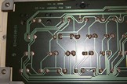
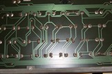
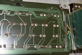
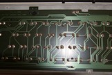

# Atari XL/XE function keys
The Atari 1200XL introduced four function keys.   
When switching from the original 400/800 Atari 8-bit machines to the ill-fated 1200XL, Atari dropped 2 joystick ports from 4 to 2, and added on-board diagonstics, BASIC ROM and four function keys. Back in fall of 1984, I received an 600XL and TRAK disk drive, joystick, and two games. Since the XL/XE Atari OS still contained the function key code, I modded my 600, later adding cursor/function keys.  
Extra buttons default to cursor keys, Shift to jump on page top/Bottom/left margin/right margin, and Ctrl for special features.  
 
 
  
 
 
 
 
  
My original 600XL keyboard used non-membrane keyboards before cost reductions.  
first three images show keyboard traces, last shows missed 1-2" section between 1st & 2nd 

  
Here is my added four Tac switches on circuit board.  
Wires (right to left) are Orange-17, Yellow-10, Green-8, Blue-5   
24 pin keyboard ribbon/connector, solder wires to pins 5, 8, 10, 17 from top of case.  
**⇧** Y-B (pins 10 & 5)  
**⇩** O-B (pins 17 & 5)  
**⇦** Y-G (pins 10 & 8)  
**⇨** O-G (pins 17 & 8)  
 
